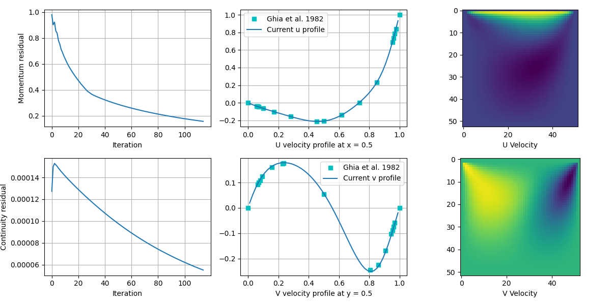

# SIMPLE-taichi
SIMPLE-taichi is an incompressible fluid solver implementing the [SIMPLE method](https://en.wikipedia.org/wiki/SIMPLE_algorithm) written in [Taichi](https://docs.taichi-lang.org/docs). The target flow field is rectangular with typical boundary conditions (inflow/outflow/wall).

## Features
- Finite Volume Method (FVM)
- Built-in Conjugate-Gradient (CG) and BiCGSTAB solver

## Requirement
- Taichi 1.0.0
- Matplotlib

## Demo
As a concrete validation, the computation results of a lid-driven cavity case are compared with the well-know literature values.

